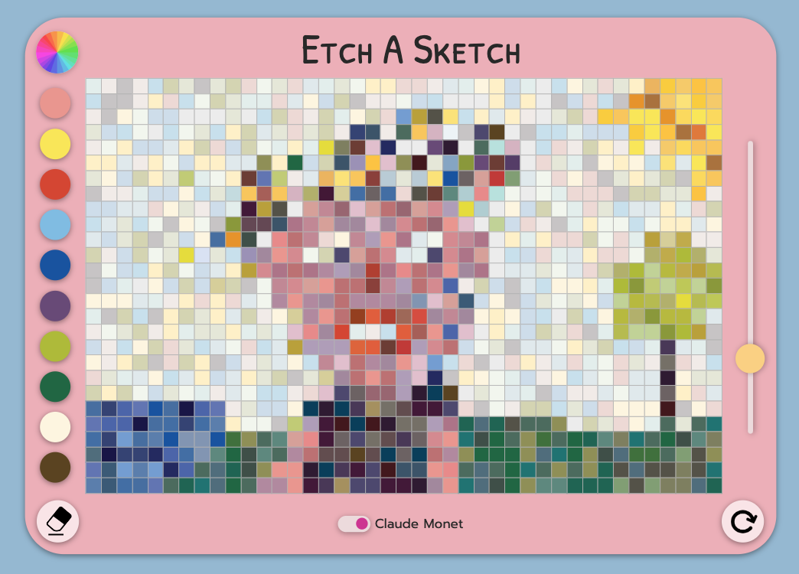
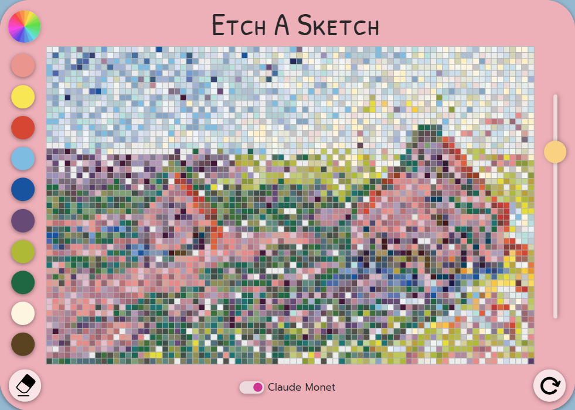
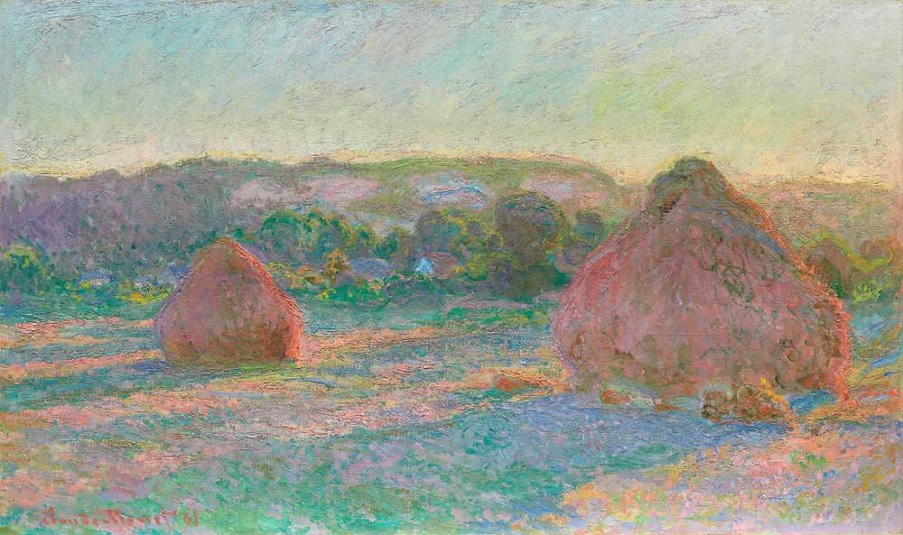

# Etch A Sketch

[Draw now!](https://mrzadzinski.github.io/etch-a-sketch/)

Application simulates an old-school drawing toy enhanced by digital functions.

## Features
* Drawing!
* Color picker
* Grid size slider
* Lighten smoothly
* Darken smoothly
* Rainbow mode (random out of 120 matching colors)
* Eraser
* Clear canvas
* **Claude Monet mode:**
    * 10 impressionist buttons
    * 12 colors from a given palette each

Artwork from app:

Original: 

## Technologies
* Javascript
* HTML
* CSS

## Skills practiced
* Javascript - DOM Manipulation and Events
* Javascript - methods and built in functions (parseInt, slice, setInterval etc.)
* Basic operations with colors
* Attempt to write clean and readable code
* PROBLEM SOLVING

## Acknowledgments
* This project is an assignment from The Odin Project course:
  * [Etch-A-Sketch](https://www.theodinproject.com/lessons/foundations-etch-a-sketch)
* [General mood of the project inspiration](https://artis-dev.github.io/etch-a-sketch/)
* [Grid slider and round color picker inspiration](https://michalosman.github.io/etch-a-sketch/)